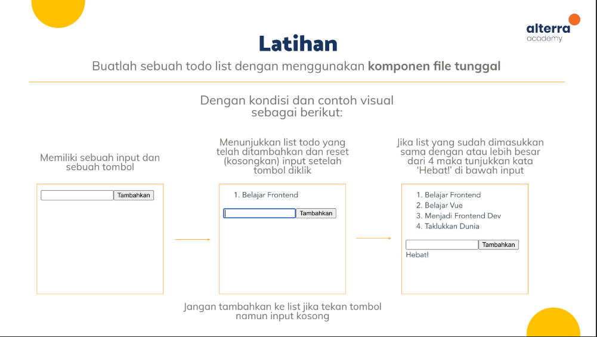

# latihan-materi-3
Repositori ini berisi latihan pertemuan ke-3 pelatihan VueJs dari Kartu Prakerja. Latihan ini mencakup pembuatan project menggunakan Vue-CLI, Single File Component(SFC), dan dasar-dasar vuex.

## Latihan


## Project setup
```
npm install
```

### Compiles and hot-reloads for development
```
npm run serve
```

### Compiles and minifies for production
```
npm run build
```

### Lints and fixes files
```
npm run lint
```

### Customize configuration
See [Configuration Reference](https://cli.vuejs.org/config/).
